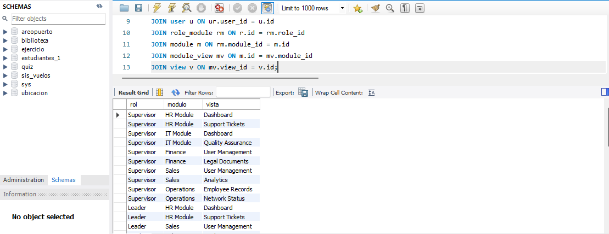

# Mostar la lista de vistas a las que tiene acceso un rol. Enviar como condición el nombre del rol [role](name)

- [role] rol(name)
- [module] modulo(name)
- [view] vista[name]

```sql
SELECT 
    r.name AS rol,
    m.name AS modulo,
    v.name AS vista
FROM 
    role r
JOIN user_role ur ON r.id = ur.role_id
JOIN user u ON ur.user_id = u.id
JOIN role_module rm ON r.id = rm.role_id
JOIN module m ON rm.module_id = m.id
JOIN module_view mv ON m.id = mv.module_id
JOIN view v ON mv.view_id = v.id;
```

# Resultado
