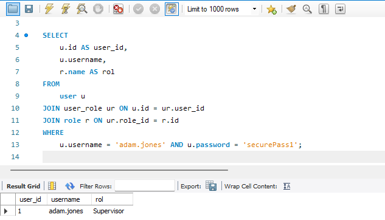

# Caso 3: Visualización de Roles, Módulos y Vistas Asociadas a un Usuario
## Codigo
```sql
SELECT 
     u.id AS user_id,
    u.username,
    r.name AS rol
FROM 
    user u
JOIN user_role ur ON u.id = ur.user_id
JOIN role r ON ur.role_id = r.id
WHERE 
    u.username = 'username' AND u.password = 'password';
```

## Ejemplo de busqueda
```sql
SELECT 
    u.id AS user_id,
    u.username,
    r.name AS rol
FROM 
    user u
JOIN user_role ur ON u.id = ur.user_id
JOIN role r ON ur.role_id = r.id
WHERE 
    u.username = 'adam.jones' AND u.password = 'securePass1';

```
### Resultado

